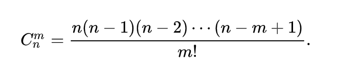

# combination
### 排列组合



```js
// n = 6, m = 2
function combination (m, n) {
  let ans = 1;
  for (let x = n - m + 1, y = 1; y <= m; x++, y++) {
    ans = ans * x / y;
  }
  return Math.round(ans);
};

combination(2, 6)  // 15
```